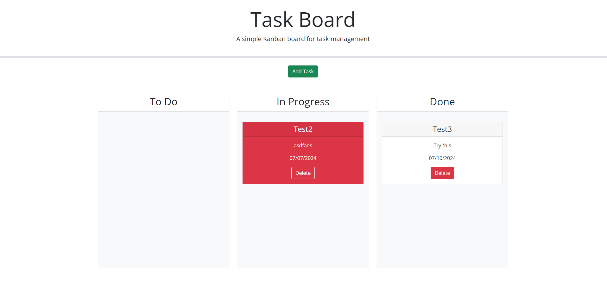

# Task-Board

## Description
This project was made to build familiarity with bootsrap and jquery. It uses local storage to save and load tasks on a task board and uses a bootstrap modal as a form for the user to enter tasks. 

[A link to the website](https://akaufmanfrey.github.io/task-board/)

## Installation

N/A

## Usage

A tool for a user to organize tasks into "To-Do", "In progress", and "Done" columns. The user can click and drag tasks from one column to another to track their completion. It also color codes cards based on whether the due date is near or if they are overdue.

## Credits

N/A

## License

Please refer to the LICENSE in the repo.